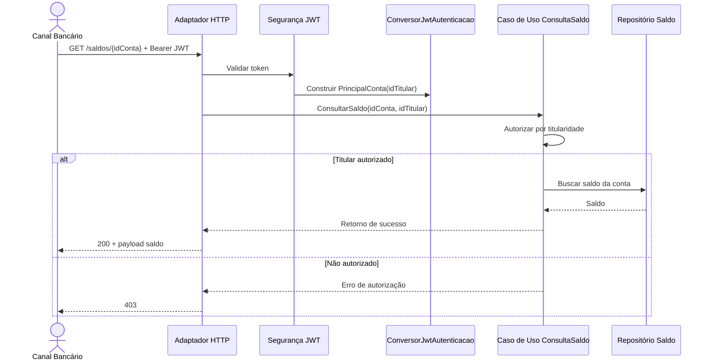
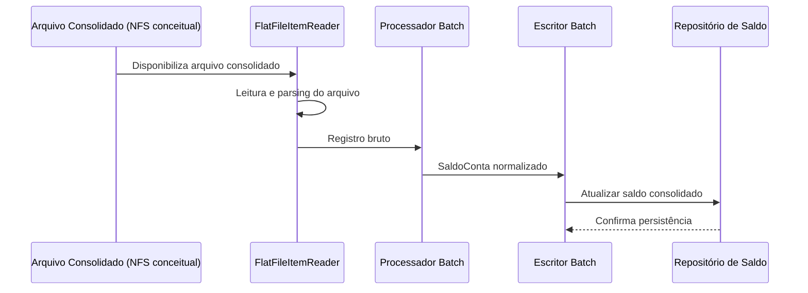
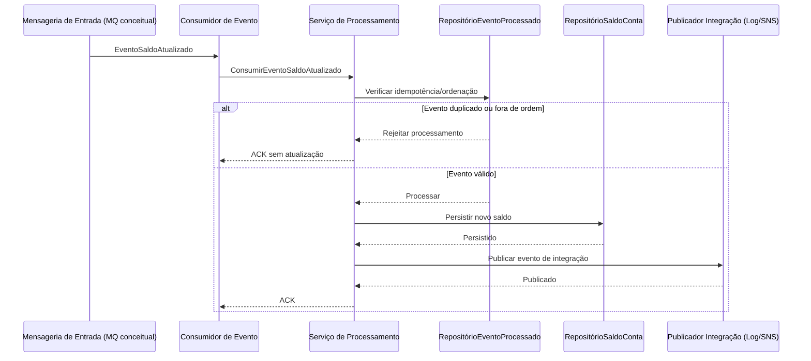

# Arquitetura da Solução

## Visão geral
Este projeto foi estruturado como um serviço central de saldo dentro de um ecossistema distribuído bancário, adotando arquitetura hexagonal para isolar regras de negócio de detalhes de infraestrutura.

> **Nota desta avaliação:** as integrações com **NFS**, **MQ** e **AWS** estão representadas de forma **conceitual** nos diagramas e no texto. O desenho evidencia pontos de integração e responsabilidades arquiteturais, sem implicar implementação completa desses provedores neste repositório.

Camadas:
- **Domínio**: modelos e exceções do negócio de saldo.
- **Aplicação**: portas e serviços de orquestração dos casos de uso.
- **Infraestrutura**: adaptadores de entrada e saída (HTTP, leitura batch, publicação de eventos, repositório).
- **Compartilhado**: tratamento global de erro e objetos transversais.


## Separação explícita entre API e Batch
- **API (consulta online/autorização de titularidade):** fluxo síncrono orientado a baixa latência para consulta de saldo, com autenticação JWT e autorização por titularidade aplicada no caso de uso.
- **Batch (carga massiva consolidada e reconciliação):** fluxo assíncrono para ingestão de massa e reconciliação periódica, preparado para processar grandes volumes sem impacto direto na experiência online.
- **Domínio compartilhado, responsabilidades diferentes:** ambos os fluxos usam o mesmo domínio e portas de aplicação, porém com objetivos operacionais distintos e ciclos de execução diferentes.

## Diagrama de contexto (C4 simplificado)

```mermaid
flowchart LR
    CB[Ator: Canal Bancário]
    SCS[(Serviço Central de Saldo)]
    LEG[Legado/Mainframe Batch]
    MEN[Mensageria de Entrada\n(MQ conceitual)]
    AWS[Consumidores Externos via AWS\n(SNS/SQS conceitual)]

    CB -->|Consulta de saldo (API)| SCS
    LEG -->|Arquivo consolidado (NFS conceitual)| SCS
    MEN -->|Evento de atualização| SCS
    SCS -->|Evento de integração de saldo| AWS
```

O contexto evidencia o serviço de saldo como núcleo da solução, recebendo tráfego síncrono (API), assíncrono (mensageria) e carga batch, além de publicar eventos para ecossistema externo via AWS em desenho conceitual.

## Diagrama de componentes (hexagonal)

```mermaid
flowchart LR
    subgraph Entrada[Adaptadores de Entrada]
        HTTP[HTTP API]
        MSG[Mensageria\n(MQ/JMS)]
        BAT[Batch Leitor\n(NFS)]
    end

    subgraph Nucleo[Núcleo Hexagonal]
        DOM[Domínio]
        APP[Aplicação + Portas]
        DOM --- APP
    end

    subgraph Saida[Adaptadores de Saída]
        JPA[Repositório local/JPA]
        DDB[DynamoDB\n(esqueleto)]
        PUBLOG[Publicador Log]
        PUBSNS[Publicador SNS\n(conceitual)]
    end

    HTTP --> APP
    MSG --> APP
    BAT --> APP

    APP --> JPA
    APP --> DDB
    APP --> PUBLOG
    APP --> PUBSNS
```

O componente segue arquitetura hexagonal: regras no núcleo e dependências para infraestrutura sempre orientadas por portas.

## Fluxo da API
1. Cliente envia requisição ao endpoint de saldo com `Authorization: Bearer <token JWT>`.
2. Camada de segurança valida o token JWT via Spring Security OAuth2 Resource Server (único mecanismo ativo de autenticação).
3. Após validação, `ConversorJwtAutenticacao` monta o principal `PrincipalConta` com `idCliente` (via claim `idCliente` ou `sub`) e `documento` obrigatório (via `documento`, `cpf` ou `cnpj`).
4. Adaptador HTTP encaminha `idConta` e o `idCliente` autenticado para a porta de entrada da aplicação.
5. Caso de uso executa a regra de autorização por titularidade, verificando se o `idCliente` autenticado corresponde ao `idTitular` da conta consultada.
6. Se autorizado, o caso de uso consulta a porta de saída de saldo e devolve resposta de sucesso.
7. Se não autorizado, a aplicação retorna erro de acesso; demais erros de domínio seguem para o handler global.

### Sequência: consulta de saldo via API



## Fluxo batch
1. Arquivo consolidado (~50GB) é disponibilizado no ambiente de arquivos (NFS).
2. `LeitorRegistroArquivoSaldoBatch` usa `FlatFileItemReader` para ler o arquivo consolidado.
3. `ProcessadorRegistroSaldoBatch` converte os registros de entrada para o modelo de domínio `SaldoConta`.
4. `EscritorSaldoContaBatch` persiste os saldos pela porta de repositório.
5. `MonitoramentoFalhaBatchListener` registra falhas do step para observabilidade.

### Sequência: fluxo batch consolidado



## Fluxo de eventos
1. Atualizações de saldo chegam por mensageria (ex.: MQ em cenário real).
2. Serviço de aplicação atualiza estado de saldo.
3. Evento de domínio `EventoSaldoAtualizado` é criado.
4. Porta de saída publica evento de integração para ecossistema AWS.
5. SNS é o ponto de fanout e consumidores assinam via SQS em cenário real.
6. Esse desenho desacopla consumidores, permite retries independentes e aumenta resiliência operacional.
7. Adaptadores locais/AWS mantêm a infraestrutura desacoplada do núcleo de aplicação.

### Sequência: ingestão de evento de saldo




## Estratégia de persistência
- No **profile local**, a porta de repositório de saldo é atendida por adaptador JPA/H2 com entidades de infraestrutura, preservando o domínio limpo (sem anotações JPA nos records de domínio).
- Também no local, há persistência de **eventos processados** para suportar deduplicação/idempotência em evoluções de consumo de fila.
- No **profile aws**, existe um adaptador esqueleto para DynamoDB com configuração dedicada (tabela, região, endpoint e credenciais via IAM role/secrets/variáveis de ambiente).
- A integração real com AWS está fora do escopo deste teste técnico, mas a estrutura foi deixada pronta para evolução segura.


> Convenção de linguagem adotada: **português neste desafio**; em projeto real, a preferência é por nomenclatura técnica em **inglês**.

## Fluxo de atualização de saldo por mensageria (quase em tempo real)

Além da API síncrona e do batch consolidado, existe um fluxo de ingestão assíncrona para atualização quase em tempo real de saldo:

1. Adaptador de entrada `infraestrutura.adaptador.entrada.mensageria.ConsumidorSaldoMqJmsSimuladoAdaptador` simula recebimento de evento MQ/JMS.
2. O adaptador não conversa com controller HTTP; ele aciona diretamente a porta de entrada da aplicação (`ConsumirEventoSaldoAtualizadoPortaEntrada`).
3. O serviço de aplicação `ServicoProcessamentoEventoSaldoAtualizado` aplica:
   - idempotência por `idEvento` (`RepositorioEventoProcessadoPortaSaida`),
   - descarte de evento duplicado,
   - descarte de evento desatualizado (fora de ordem) para evitar regressão de saldo.
4. Quando válido, o saldo é persistido em `RepositorioSaldoContaPortaSaida`.

Essa separação preserva os princípios de arquitetura hexagonal e evidencia o caminho de atualização assíncrona, sem acoplamento com a camada web.

### Tratamento conceitual de falhas e DLQ (design)
Neste repositório, não há integração real com broker. Ainda assim, o desenho recomendado para produção é:
- `retry` com backoff para falhas transitórias (rede, indisponibilidade temporária);
- classificação de falhas recuperáveis e não recuperáveis;
- encaminhamento para DLQ após exceder tentativas máximas;
- payload + metadados de erro na DLQ para observabilidade e replay controlado;
- dashboards/alertas por taxa de erro, latência de consumo e volume de DLQ.


## Publicação de evento de integração de saldo atualizado
- Evento de integração: `dominio.modelo.EventoIntegracaoSaldoAtualizado`.
- Porta de saída: `aplicacao.porta.saida.PublicadorEventoIntegracaoSaldoPortaSaida`.
- Adapter local padrão: `infraestrutura.adaptador.saida.evento.PublicadorEventoIntegracaoSaldoLogAdaptador` (log estruturado).
- Adapter AWS esqueleto: `infraestrutura.adaptador.saida.evento.PublicadorEventoIntegracaoSaldoSnsAwsAdaptador` (SNS, sem integração real).

### Papel do SNS + SQS no cenário real
- SNS atua como fanout para disseminar o evento a múltiplos domínios consumidores.
- Cada consumidor assina via fila SQS própria, com isolamento de throughput, retry e DLQ.
- Esse padrão reduz acoplamento temporal e aumenta resiliência do ecossistema distribuído.

### Outbox como evolução futura
Nesta avaliação técnica, a publicação é direta após atualização do saldo.
Como evolução recomendada para produção, adotar padrão Outbox transacional para garantir consistência entre persistência de saldo e publicação assíncrona.
